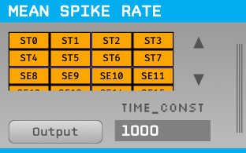

# Mean Spike Rate Plugin

Estimates the mean spike rate over time and channels. Uses an exponentially weighted moving average to estimate a temporal mean (with adjustable time constant), and averages the rate across selected spike channels (electrodes). Outputs the resulting rate onto a single selected continuous channel (overwriting its contents).

## Installation

This plugin can be added via the Open Ephys GUI Plugin Installer. To access the Plugin Installer, press **ctrl-P** or **⌘P** from inside the GUI. Once the installer is loaded, browse to the "Mean Spike Rate" plugin and click "Install."

## Usage:

* Place the plugin somewhere after a Spike Sorter or Spike Detector. 

* After adding some single electrodes, stereotrodes, and/or tetrodes, you should see corresponding toggle buttons show up in the top section. These can be selected/deselected to include/exclude them in the average. The output is divided by the number of spike channels selected, so two identical spike channels should produce the same output whether one of them or both are selected.

* In the "Output:" combo box, select a continuous channel on which to output the average.

* Change the time constant, if desired. This is defined as the period over which the average decays by a factor of 1/e.